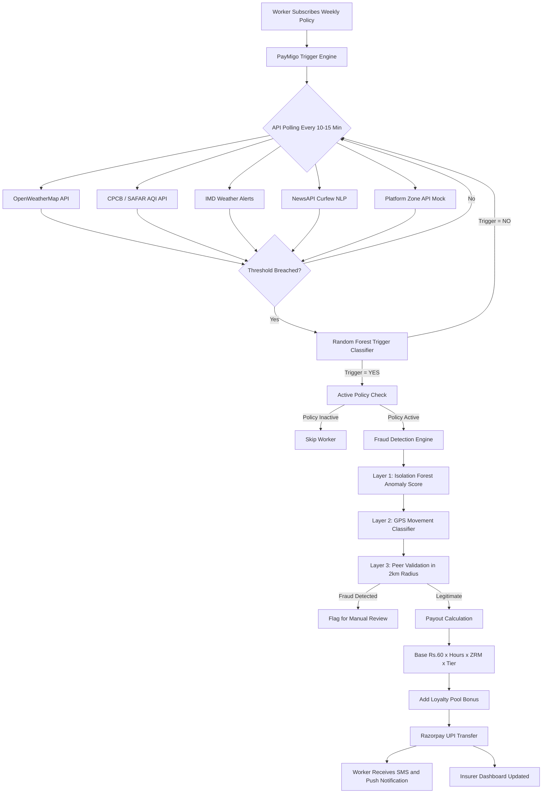

# PayMigo — AI-Powered Parametric Income Insurance for Food Delivery Workers

**Guidewire DEVTrails 2026 | Team PayMigo | Food Delivery Persona — Zomato / Swiggy**

Live Demo: [Link to your Vercel deployment]
Phase 1 Video: [Link to your 2-minute strategy video]

---

## 1. The Problem

India has over 5 million active food delivery partners working on platforms like Zomato and Swiggy. These workers earn between Rs.3,500 and Rs.7,000 per week entirely through completed deliveries. There is no fixed salary. When an external disruption occurs — heavy rain, severe air pollution, a city-wide curfew, or a platform outage — their income drops to zero immediately, yet their fixed costs continue without pause.

A typical disruption week looks like this:

| Day       | Condition                   | Orders | Earnings  |
|-----------|-----------------------------|--------|-----------|
| Monday    | Clear, moderate traffic     | 22     | Rs.1,100  |
| Tuesday   | Overcast                    | 18     | Rs.870    |
| Wednesday | Heavy rain — IMD Red Alert  | 3      | Rs.180    |
| Thursday  | AQI above 350 — Severe      | 0      | Rs.0      |
| Friday    | City curfew — Section 144   | 0      | Rs.0      |
| Saturday  | Normal conditions           | 20     | Rs.980    |
| Sunday    | Festival surge              | 28     | Rs.1,600  |
| **Total** |                             |        | **Rs.4,730 vs Rs.6,720 projected** |

The worker lost Rs.1,990 — nearly 30 percent of expected earnings — across just three disruption days. At the same time, their daily operating costs (fuel, vehicle EMI, mobile data, food) total between Rs.326 and Rs.575 regardless of whether they earn anything.

No existing scheme addresses this gap. Government programs like PM-SBY and ESIC cover life and health risks but not income loss from environmental or civic disruptions. Platform policies offer no wage replacement. Private gig insurance products focus on vehicle or accident coverage. The income protection gap is completely unaddressed.

---

## 2. Our Solution

PayMigo is a parametric income insurance platform built exclusively for food delivery workers. It monitors external disruption data in real time, automatically detects when a worker cannot earn due to a verified disruption event, and transfers their lost income directly to their UPI account — without requiring the worker to file any claim.

The core guarantee is simple: when the sky shuts you down, PayMigo pays you. Automatically. In under 90 seconds.

The platform operates on three technical pillars.

The first is a parametric trigger engine that polls weather, air quality, traffic, government alert, and platform APIs every 5 to 15 minutes. When a pre-defined threshold is breached in a worker's active zone — such as rainfall exceeding 50mm per hour or AQI crossing 300 — the system initiates a claim without any human action.

The second is an AI-powered dynamic pricing engine built on XGBoost that calculates each worker's weekly premium based on their city zone, disruption history, seasonal risk factors, and real-time environmental data. Premiums start at Rs.49 per week and scale to Rs.189 per week, always priced on a weekly basis to match the gig worker's payment cycle.

The third is a multi-layer fraud detection system combining Isolation Forest anomaly detection, a Random Forest GPS movement classifier, and a peer validation network. Together they ensure that only genuine income loss events trigger payouts.

---

## 3. Target Persona

**Ravi Kumar — Food Delivery Partner, Mumbai**

Ravi is 24 years old and works primarily for Zomato, with occasional orders on Swiggy. He operates out of Andheri East, a flood-prone zone in Mumbai. He works 8 to 12 hours a day, six days a week, and earns between Rs.5,500 and Rs.7,000 per week under normal conditions. He uses a Redmi 9A (3GB RAM, Android 10), pays through PhonePe, and holds a Jan Dhan bank account. He has no insurance of any kind. Last month he lost Rs.2,100 across six disruption days.

His primary fear: "Rain mein kaam nahi hota, lekin EMI banda nahi hoti." Work stops in the rain, but EMI doesn't.

---

## 4. Weekly Premium Model

PayMigo uses a weekly premium structure because delivery workers are paid weekly by their platforms. Asking for a monthly commitment creates a financial barrier; deducting Rs.89 on the same Monday a worker receives their platform settlement removes it entirely.

The platform offers three tiers:

| Plan       | Low Risk Zone | High Risk Zone | Max Daily Payout | Max Weekly Payout | Triggers Covered        |
|------------|---------------|----------------|------------------|-------------------|-------------------------|
| Basic      | Rs.49/week    | Rs.72/week     | Rs.300           | Rs.900            | Rain and AQI only       |
| Standard   | Rs.89/week    | Rs.129/week    | Rs.500           | Rs.1,500          | All 5 triggers          |
| Premium    | Rs.149/week   | Rs.189/week    | Rs.800           | Rs.2,400          | All 5 plus platform outage |

Premiums are not flat. An XGBoost model recalculates each worker's exact premium every Monday based on their pincode's historical disruption rate, the upcoming 7-day weather forecast, their platform tenure, current AQI trends, and their policy tier. The values above are the floor and ceiling — the actual weekly charge sits somewhere in between based on real conditions.

Zone-level pricing reflects actual risk. A worker in Chennai Velachery during monsoon season pays differently from a worker in Coimbatore during the same period. This is by design.

---

## 5. Loyalty Pool System

The most common objection to micro-insurance among gig workers is: why should I keep paying when nothing happens?

The Loyalty Pool answers that directly. Every week a worker pays their premium without filing a claim, a portion of that premium accumulates in their personal loyalty pool. When a disruption does occur, they receive their standard parametric payout plus a loyalty bonus drawn from their accumulated pool.

The unlock percentage scales with tenure:

| Continuous Paid Weeks (No Claims) | Pool Unlock Percentage |
|------------------------------------|------------------------|
| 4 to 8 weeks                       | 10 percent of premiums paid |
| 9 to 16 weeks                       | 15 percent of premiums paid |
| 17 to 26 weeks                      | 20 percent of premiums paid |
| 26 or more weeks                    | 25 percent of premiums paid |

The bonus is capped at Rs.500 per event to protect insurer solvency. A worker who paid Rs.80 per week for 32 weeks without claiming receives Rs.500 in loyalty bonus on top of their regular payout — making their total recovery larger than a full workday's earnings.

---

## 6. Parametric Triggers

PayMigo monitors five external events that directly cause income loss for food delivery workers. Each trigger has an objective, measurable threshold. When the threshold is breached in a worker's active zone, the claim fires automatically.

| Trigger           | Threshold Condition                                   | Data Source                  | Max Daily Payout |
|-------------------|-------------------------------------------------------|------------------------------|------------------|
| Heavy Rainfall    | Rainfall above 50mm/hr or IMD Red Alert issued        | IMD API + OpenWeatherMap     | Rs.480           |
| Severe Pollution  | AQI above 300 for more than 2 hours in the zone       | CPCB + SAFAR API             | Rs.480           |
| Extreme Heat      | Temperature above 45°C with Heat Index above 50°C     | IMD + MAUSAM Portal          | Rs.360           |
| Curfew or Strike  | Section 144 order or official zone suspension         | Government NLP + Platform Mock | Rs.540         |
| Platform Outage   | Zero order allocation for a zone for 90+ minutes      | Platform API Mock + Peers    | Rs.300           |

The payout formula is:

```
Daily Payout = Rs.60 x Blocked Hours x Zone Risk Multiplier x Tier Multiplier
```

Zone Risk Multiplier is 1.00 for low-risk zones, 1.10 for medium-risk, and 1.25 for high-risk zones. Tier multipliers are 1.0 for Basic, 1.2 for Standard, and 1.5 for Premium.

---

## 7. Data and Trigger Flow Diagram

This diagram shows how data moves from external sources through the platform to a payout in the worker's account.



---

## 8. Application Walkthrough

### Worker Onboarding

The worker opens a WhatsApp link shared by the Zomato partner community. The link opens PayMigo as a Progressive Web App in Chrome — no Play Store installation required. The full onboarding takes under 5 minutes and requires zero paperwork.

Step 1 — Phone OTP registration via Twilio SMS. Language selection: English, Hindi, or Tamil.

Step 2 — Zomato Partner ID entry. The system calls a platform mock API to verify active delivery status.

Step 3 — Pincode entry. The K-Means clustering model runs in the background and assigns the pincode to a risk tier (1 through 5), returning a Zone Risk Multiplier.

Step 4 — Premium quote displayed. "Your zone: Andheri East. Risk level: High. Your weekly premium: Rs.89."

Step 5 — UPI payment via Razorpay. Policy activates within 60 seconds. Auto-renews every Monday with no action required from the worker.

### Automated Claim Flow

When a threshold is breached, the following sequence runs without any worker action:

```
T+0:00  Trigger engine detects rainfall = 85mm/hr in Zone X
T+0:05  Random Forest Classifier confirms trigger is valid
T+0:08  Active policy holders in Zone X identified via PostGIS query
T+0:12  3-layer fraud check runs for each eligible worker
T+0:17  Payout calculated: Rs.60 x hours x ZRM x tier multiplier
T+0:19  Loyalty bonus added
T+1:27  Razorpay initiates UPI transfer
T+1:32  Payment confirmed via webhook
T+1:33  SMS sent in worker's language
T+1:33  Admin dashboard updated with claim record

Total elapsed time: under 90 seconds. Manual actions by worker: zero.
```

---

## 9. AI and Machine Learning Integration

PayMigo uses six machine learning models, each solving a distinct problem in the insurance lifecycle.

**Zone Risk Clustering (K-Means)** — Groups delivery pincodes into five risk tiers using historical disruption frequency, average rainfall, flood zone classification, and seasonal AQI data. This feeds the premium pricing engine and determines the Zone Risk Multiplier. Built in Phase 1.

**Dynamic Premium Calculator (XGBoost)** — Predicts the optimal weekly premium for each worker using eight input features including zone tier, current month, LSTM forecast score, platform tenure, and loyalty weeks. Recalculated every Monday. Built in Phase 2.

**Trigger Classifier (Random Forest)** — At the moment a threshold is crossed, this model makes the binary decision: is this event severe enough to trigger a payout? It outputs a YES or NO with a confidence score. Built in Phase 2.

**Curfew Detection (TF-IDF + Logistic Regression)** — Monitors news feeds and government RSS channels every 30 minutes. Classifies headlines and notifications as curfew-eligible or normal using a text classification pipeline. Built in Phase 2.

**Fraud Detector (Isolation Forest)** — Scores every incoming claim against the historical distribution of legitimate claims for that zone and trigger type. Claims more than two standard deviations from the norm are flagged for review. Built in Phase 3.

**GPS Spoofing Classifier (Random Forest)** — Analyses the worker's GPS trace in the 30-minute window before a trigger fires. Genuine delivery workers show characteristic movement patterns: continuous motion at 12 to 30 km/h, frequent turns, and stop clusters at restaurants and customer locations. Spoofed GPS shows either a stationary cluster or physically impossible position changes. Built in Phase 3.

**Risk Forecaster (LSTM Neural Network)** — Processes 14 days of sequential weather data per zone to predict disruption probability for the coming 7 days. Output feeds the premium calculator and powers the predictive analytics panel on the insurer dashboard. Built in Phase 3.

---

## 10. Fraud Detection Architecture

Parametric insurance carries an inherent fraud risk because payouts trigger on data thresholds rather than damage evidence. PayMigo counters this with three sequential layers.

**Layer 1 — Isolation Forest anomaly detection.** Every claim is scored against the distribution of historical claims for that zone, trigger type, and time of day. Ghost accounts, unusual payout amounts, and suspicious timing are caught here.

**Layer 2 — GPS movement classification.** A Random Forest model classifies the worker's recent GPS trace. If the device shows stationary coordinates or impossible jumps between positions, the claim is rejected as likely spoofed.

**Layer 3 — Peer validation network.** For auto-approval, a minimum of three independently operating workers within a 2km radius must have the same trigger fire simultaneously. If fewer peers confirm the event while many others in the same zone do not trigger, the claim escalates to manual review.

Additional safeguards include triple KYC (phone number, Aadhaar hash, and platform ID) at onboarding, a weekly claim velocity cap per plan tier, a 48-hour post-claim monitoring window, and trusted-status processing for workers with six or more months of clean claim history.

---

## 11. Tech Stack

**Frontend and API**

The worker PWA and insurer admin portal are both served from a single Next.js 14 application using the App Router. Tailwind CSS handles all styling. TanStack Query manages server state and background data synchronisation. Zustand handles global client state. React-Leaflet renders the zone risk heatmap on the insurer dashboard. next-intl provides Hindi, Tamil, and English translations. The app is configured as a PWA using next-pwa, making it installable on low-end Android devices without any app store involvement.

**Backend**

Next.js API Routes serve as the primary backend for authentication, policy management, claims processing, and payout initiation. FastAPI (Python 3.11) serves all machine learning models as REST endpoints and handles the API polling background jobs. Prisma ORM v5 manages all PostgreSQL queries with full type safety. NextAuth v5 handles OTP-based phone authentication. Bull Queue backed by Redis manages scheduled jobs including Monday premium renewal and API polling tasks.

**Database and Cache**

PostgreSQL (Supabase free tier) is the primary database for workers, policies, claims, and payouts. The PostGIS extension enables geospatial queries for zone-to-worker matching and GPS validation. MongoDB Atlas stores trigger event logs and fraud audit trails. Upstash Redis caches session data and live trigger states.

**Machine Learning**

XGBoost 2.0 for premium calculation. scikit-learn 1.5 for Isolation Forest, both Random Forest models, K-Means clustering, and TF-IDF classification. TensorFlow 2.16 with Keras for the LSTM forecaster. All models are serialised to .pkl or .h5 files and loaded by FastAPI at startup.

**External APIs**

OpenWeatherMap free tier for rainfall, temperature, and wind data polled every 10 minutes. CPCB and SAFAR APIs for AQI data polled every 15 minutes. IMD and MAUSAM portal for official weather alerts. NewsAPI plus PIB RSS feeds for curfew and strike detection polled every 30 minutes. Razorpay test mode for UPI payout simulation. Twilio Sandbox for SMS and WhatsApp notifications.

**Hosting**

Vercel hosts the Next.js application at no cost. Render hosts the FastAPI ML service at no cost. Supabase provides PostgreSQL and PostGIS on the free tier. Docker Compose is used for local development to run all backing services with a single command.

---

## 12. Project Structure

```
paymigo/
|
|-- apps/
|   |-- web/                         Next.js 14 — Worker PWA and Admin Portal
|   |   |-- app/
|   |   |   |-- (auth)/
|   |   |   |   |-- login/           OTP login page
|   |   |   |   +-- register/        Five-step worker onboarding wizard
|   |   |   |-- (worker)/
|   |   |   |   |-- dashboard/       Worker home screen with live widgets
|   |   |   |   |-- policy/          Active policy management
|   |   |   |   |-- claims/          Claim history and status
|   |   |   |   |-- payouts/         UPI payout history and receipts
|   |   |   |   +-- wellness-vault/  Hair and skin risk scoring modules
|   |   |   |-- (insurer)/
|   |   |   |   +-- admin/
|   |   |   |       |-- dashboard/   Portfolio overview
|   |   |   |       |-- claims/      Claims table and fraud queue
|   |   |   |       |-- analytics/   Loss ratios and financial metrics
|   |   |   |       +-- forecast/    LSTM next-week prediction panel
|   |   |   +-- api/
|   |   |       |-- auth/            OTP send and verify routes
|   |   |       |-- workers/         Worker profile CRUD
|   |   |       |-- policies/        Policy management routes
|   |   |       |-- premium/         Calls FastAPI XGBoost model
|   |   |       |-- triggers/        Live trigger status and manual check
|   |   |       +-- payouts/         Razorpay initiation and webhook
|   |   |-- components/
|   |   |   |-- worker/              Policy card, zone indicator, payout history
|   |   |   |-- insurer/             Loss ratio chart, fraud queue, heatmap
|   |   |   |-- onboarding/          Steps 1 through 5 as individual components
|   |   |   +-- ui/                  Button, Card, Badge, Toast, LanguageToggle
|   |   |-- lib/
|   |   |   |-- ml-client.ts         HTTP client for FastAPI ML endpoints
|   |   |   |-- payout-calculator.ts Base rate x hours x ZRM x tier formula
|   |   |   +-- loyalty-pool.ts      Loyalty bonus calculation
|   |   +-- i18n/
|   |       |-- en.json
|   |       |-- hi.json              Hindi translations
|   |       +-- ta.json              Tamil translations
|   |
|   +-- ml-service/                  FastAPI Python — All ML Models
|       +-- app/
|           |-- main.py
|           |-- api/
|           |   |-- premium.py       POST /premium/calculate (XGBoost)
|           |   |-- fraud.py         POST /fraud/check (Isolation Forest + GPS)
|           |   |-- forecast.py      GET /forecast/{zone} (LSTM)
|           |   |-- trigger.py       POST /trigger/classify (Random Forest)
|           |   +-- cluster.py       GET /cluster/zone-risk (K-Means)
|           |-- models/
|           |   |-- premium_engine/  train.py, predict.py, xgboost_model.pkl
|           |   |-- fraud_detector/  train.py, predict.py, isolation_forest.pkl, gps_rf_model.pkl
|           |   |-- risk_forecaster/ train.py, predict.py, lstm_model.h5
|           |   +-- zone_clusterer/  train.py, predict.py, kmeans_zones.pkl
|           |-- tasks/
|           |   |-- api_polling.py   Runs every 10 to 15 minutes
|           |   +-- premium_renewal.py  Runs every Monday at 6am
|           +-- data/
|               |-- synthetic_workers.csv
|               |-- imd_rainfall_2020_2024.csv
|               +-- zone_risk_history.csv
|
|-- packages/
|   +-- database/
|       +-- prisma/
|           +-- schema.prisma
|
|-- docker-compose.yml
|-- .env.example
+-- turbo.json
```

---

## 13. Database Schema

```prisma
model Worker {
  id               String   @id @default(cuid())
  phone            String   @unique
  zomatoPartnerId  String?
  cityZone         String
  pincode          String
  riskTier         Int      @default(1)
  loyaltyWeeks     Int      @default(0)
  totalPremiumPaid Float    @default(0)
  policies         Policy[]
  claims           Claim[]
  createdAt        DateTime @default(now())
}

model Policy {
  id            String   @id @default(cuid())
  workerId      String
  tier          String
  weeklyPremium Float
  startDate     DateTime
  endDate       DateTime
  isActive      Boolean  @default(true)
  autoRenew     Boolean  @default(true)
  zoneRiskMult  Float    @default(1.0)
}

model Claim {
  id           String   @id @default(cuid())
  workerId     String
  policyId     String
  triggerType  String
  triggerValue Float
  blockedHours Float
  baseAmount   Float
  loyaltyBonus Float    @default(0)
  totalPayout  Float
  fraudScore   Float
  status       String
  payoutId     String?
  createdAt    DateTime @default(now())
}

model TriggerEvent {
  id              String   @id @default(cuid())
  zone            String
  triggerType     String
  actualValue     Float
  threshold       Float
  affectedWorkers Int
  firedAt         DateTime
}
```

---

## 14. Business Viability

PayMigo operates as a technology and distribution layer. A licensed insurer (such as ACKO or Go Digit) underwrites the policies. PayMigo retains a 15 to 20 percent technology fee from each premium collected, with the insurer carrying the remaining risk.

The total addressable market is 5.2 million active Zomato and Swiggy partners. At an average blended premium of Rs.3,900 per worker per year, the market opportunity at full penetration is Rs.2,847 crore. At a conservative 10 percent penetration in Year 1, gross written premium would be approximately Rs.284 crore with PayMigo platform revenue of Rs.42 to Rs.57 crore annually.

The target loss ratio is 55 to 65 percent, which is sustainable for a micro-insurance product at this scale. Zone-based dynamic pricing ensures that high-risk zones pay appropriately higher premiums, keeping the portfolio balanced across geographies.

The product can be launched under the IRDAI Innovation Sandbox framework introduced in 2023, which allows parametric insurance products to operate with a streamlined approval process.

---

## 15. Six-Week Delivery Plan

**Phase 1 — March 4 to 20: Ideation and Foundation**

Deliverables: complete problem and solution documentation, persona definition, weekly premium model specification, parametric trigger definitions, ML model selection and architecture, tech stack finalisation, Prisma schema draft, K-Means zone clustering model (v1), synthetic training data generation, Docker setup, and a 2-minute strategy video.

**Phase 2 — March 21 to April 4: Automation and Protection**

Deliverables: worker registration PWA with OTP auth, five-step onboarding wizard, policy creation and Monday auto-renewal, XGBoost premium calculator deployed to FastAPI, five parametric trigger automations, Random Forest trigger classifier, TF-IDF curfew NLP detector, basic fraud checks (duplicate, GPS zone, velocity throttle), Razorpay UPI sandbox payout flow, worker dashboard v1, and a 2-minute demo video.

**Phase 3 — April 5 to 17: Scale and Optimise**

Deliverables: Isolation Forest fraud detection, Random Forest GPS spoofing classifier, PostGIS peer validation network, LSTM weather risk forecaster, full Loyalty Pool implementation, Wellness Vault (hair and skin risk scoring), complete insurer analytics dashboard with React-Leaflet heatmap, LSTM forecast panel, 5-minute final demo video, and pitch deck PDF.

---

## 16. Running Locally

Prerequisites: Node.js 18 or higher, Python 3.11 or higher, Docker.

```bash
# Clone the repository
git clone https://github.com/your-team/paymigo.git
cd paymigo

# Copy environment variables and fill in your values
cp .env.example .env.local

# Start backing services (PostgreSQL and Redis)
docker-compose up -d

# Install all dependencies
npm install

# Start Next.js and FastAPI together
npm run dev

# Next.js runs on http://localhost:3000
# FastAPI runs on http://localhost:8000
# FastAPI API docs at http://localhost:8000/docs
```

To train the ML models for the first time:

```bash
cd apps/ml-service
pip install -r requirements.txt

python app/models/zone_clusterer/train.py
python app/models/premium_engine/train.py
```

---

## 17. Team

| Name    | Role                              |
|---------|-----------------------------------|
| Name 1  | Full Stack Lead — Next.js and API |
| Name 2  | ML Engineer — XGBoost, LSTM, Fraud|
| Name 3  | Frontend and UI/UX                |
| Name 4  | Backend and DevOps                |

---

## Links

| Resource               | URL                        |
|------------------------|----------------------------|
| GitHub Repository      | [Link]                     |
| Phase 1 Strategy Video | [Link]                     |
| Phase 2 Demo Video     | [Link — added April 4]     |
| Phase 3 Final Video    | [Link — added April 17]    |
| Live Deployment        | [Vercel link]              |
| ML Service API Docs    | [Render link]/docs         |
| Figma Wireframes       | [Link]                     |

---

*Guidewire DEVTrails 2026 — Team PayMigo — Phase 1 Submission, March 20, 2026*
